 

<picture>
  <source media="(prefers-color-scheme: dark)" srcset="assets/ascii-dark.svg">
  <source media="(prefers-color-scheme: light)" srcset="assets/ascii-light.svg">
  
</picture>

### 💫 About Me

# Hi, I'm Aryan Patil 👋

### Full-Stack Developer | MERN Stack | Problem Solver

I'm passionate about building real-world applications and learning new
technologies 🚀. I mostly work across the **MERN stack**, and I like
turning ideas into clean, working products — from UI to database.

- 🔭 Currently building projects with **React, Node.js & MongoDB**
- 🌱 Always leveling up — currently exploring new tools & frameworks
- ⚡ Fun fact: this profile's portrait below is rendered entirely in **ASCII** — no image file, just text 😄
 

## 🚀 What I'm Working On
- 🌐 Building full-stack applications with the **MERN stack**
- ⚛️ Improving my **React & JavaScript** skills
- 🔧 Strengthening **Node.js, Express & MongoDB**
- 🧠 Practicing **Data Structures & Problem Solving**
- 🤖 Exploring **Python, Machine Learning & AI-powered applications**
- ☁️ Learning deployment, APIs and modern development workflows

---

## 💻 Tech Stack

### 👨‍💻 Programming Languages

  
  
  
  

### 🎨 Frontend

  
  
  
  
  

### ⚙️ Backend

  
  
  
  
  

### 🗄️ Database

  
  

### 🤖 AI / ML

  
  
  
  

### 🛠️ Tools

  
  
   
  
  
  

## 📊 GitHub Stats

</>

 

 

---

⭐ If you find any of my projects useful, feel free to star them!

